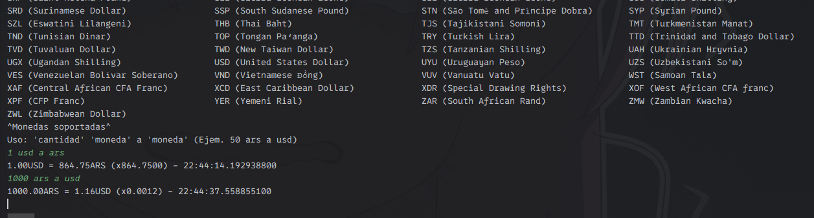

## Conversor de monedas con exchangerate-api

Convierte cualquier tipo de moneda soportada por esta api y devuelve la información relevante.

## Uso

Comando básico de conversion: `cantidad` `moneda` `a` `moneda`.

Ejemplo: `1000 ars a usd`

Una vez que se ha convertido a alguna moneda se puede utilizar la **cantidad** sola como comando para volver a convertir con los tipos de monedas previamente utilizados.

Nota: el tipo de moneda tiene que ser dado con el código de ISO como se indica al inicio del programa.

