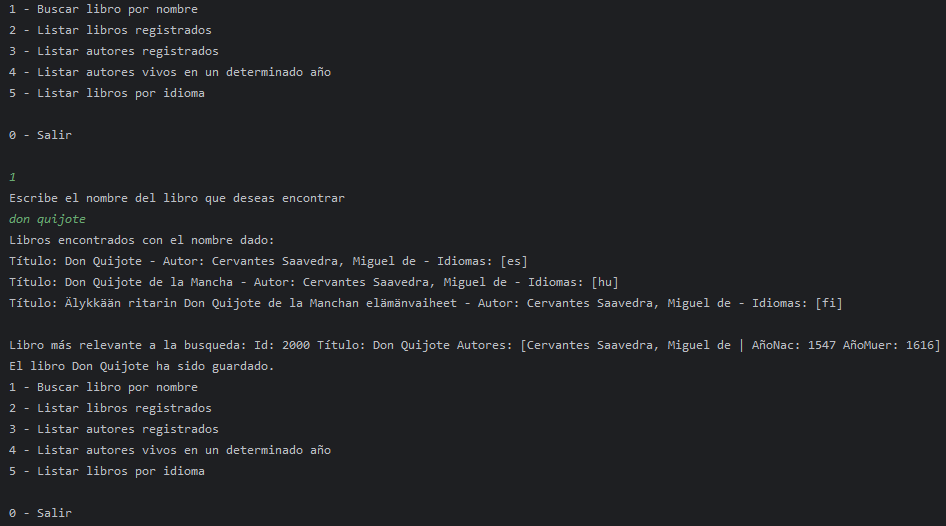

## LiterALura

Una aplicación para solicitar libros a [Gutendex](https://gutendex.com/) y guardarlos localmente utilizando Spring, Jpa y postgresql.

## Uso

Sin mucho que explicar; `Buscar libro por nombre` busca un libro y si es valido lo guarda en la DB local, mientras que los demás comandos listan esos mismos datos guardados.

